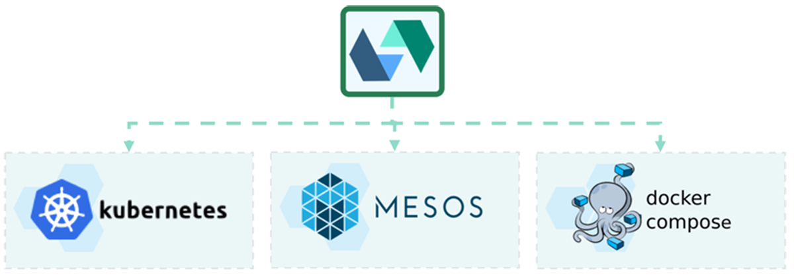

# NordDNS
> NordDNS encrypts your DNS traffic and hides your IP and physical location. Works on any devices at once, on every major platform.

> NordDNS is an advanced [recursive DNS](https://www.cloudflare.com/learning/dns/what-is-recursive-dns/) that support DNS-over-HTTPS ([DoH - RFC 8484](https://tools.ietf.org/html/rfc8484)) and DNS-over-TLS ([DoT - RFC 7858](https://tools.ietf.org/html/rfc7858)).

> NordDNS enhance your privacy by filtering advertising host from well-know filtering host-lists such as [1Hosts](https://badmojr.github.io/1Hosts/) & [EasyList](https://easylist.to/).

> NordDNS is user oriented, and therefore provide a beautiful Dashboard that includes wonderful graphs and metrics.

## Technical Architecture
Our project relies on [OpenWhisk](https://openwhisk.apache.org/), the Open Source Serverless Cloud Platform by the Apache fundation.


## Deployment
Thanks to the large variety of deployments options comming with OpenWhisk, our project can be deployed under a various set of platforms such as Kubernetes, Mesos and docker-compose:



### Production deployment
The production deployment will be done into a Kubernetes cluster, on a Cloud Provider. The exact target should be provided by the school.

### Development deployment
The dev deployment will be done under Kubernetes in DOcker for Windows, complete installation procedure can be found here: https://github.com/apache/openwhisk-deploy-kube/blob/master/docs/k8s-docker-for-windows.md

For our folks here on mac we got you, here is the documentation: https://github.com/apache/openwhisk-deploy-kube/blob/master/docs/k8s-docker-for-mac.md

---
(old doc, to be removed)
## Installation
### Installation of OpenWhisk
- Create the openwhisk namespace
```bash
kubectl create namespace openwhisk
```

- Deploy OpenWhisk
```bash
helm install owdev .\openwhisk -n openwhisk -f mycluster.yaml
```

Upgrade OpenWhisk
```bash
helm upgrade owdev .\openwhisk -n openwhisk -f mycluster.yaml
```

- Connect OpenWhisk CLI to this deployment
```bash 
wsk property set --apihost localhost:31001
wsk property set --auth 789c46b1-71f6-4ed5-8c54-816aa4f8c502:abczO3xZCLrMN6v2BKK1dXYFpXlPkccOFqm12CdAsMgRU4VrNZ9lyGVCGuMDGIwP
```

- Test Deployment
```bash
helm test owdev -n openwhisk
```

- Launch sample function (Greeting)
```bash
wsk action create greeting .\samples\greeting.js -i
wsk action invoke greeting --result -i
```

- Cleanup
```bash
helm uninstall owdev -n openwhisk
```
