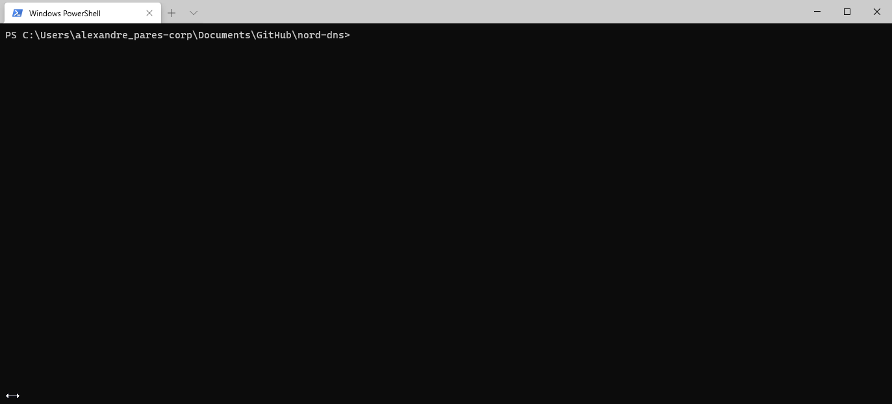

[](https://github.com/IAmFrench/nord-dns/actions/workflows/docker-publish.yml)

--- 

[](https://moleculer.services)
[](https://redis.io/) 
[](https://www.jaegertracing.io/)
[](https://grafana.com/)
[](https://traefik.io/)
[](https://prometheus.io/)
[](https://www.elastic.co/elasticsearch/)

---

# NordDNS
> NordDNS encrypts your DNS traffic and hides your IP and physical location. Works on any devices at once, on every major platform.  
NordDNS is an advanced [recursive DNS](https://www.cloudflare.com/learning/dns/what-is-recursive-dns/) that support DNS-over-HTTPS ([DoH - RFC 8484](https://tools.ietf.org/html/rfc8484)) and DNS-over-TLS ([DoT - RFC 7858](https://tools.ietf.org/html/rfc7858)).  
NordDNS enhance your privacy by filtering advertising hosts from well-know filtering host-lists such as [1Hosts](https://badmojr.github.io/1Hosts/) & [EasyList](https://easylist.to/).  
NordDNS is user oriented, and therefore provide a beautiful Dashboard that includes wonderful graphs and metrics.


## Features

### DNS-over-HTTPS
Nord DNS is exposed over HTTPS. (OSI layer 7) - [RFC8484](https://tools.ietf.org/html/rfc8484)


### DNS-over-TLS
Nord DNS is exposed over TLS. (OSI layer 4) - [RFC7858](https://tools.ietf.org/html/rfc7858) & [RFC8310](https://tools.ietf.org/html/rfc8310)


### Filter
Nord DNS is able to filter DNS queries using filter lists such as [1Hosts](https://badmojr.github.io/1Hosts/) blocklist. Using this feature you will be able to navigate on the web ad-free, by blocking advertising, trackers, spyware and malware domains at the DNS level.


## Technical Architecture
Nord DNS relies on [Moleculer](https://moleculer.services/), a progressive microservices framework for Node.js.

## Deployment

### Production deployment
The production deployment will be done into a Kubernetes cluster, on a Cloud Provider. The exact target should be provided by the school.

or you can simply use the following command:

```bash
docker-compose up -d
```


To scale in or out a service just use this command:

```bash
docker-compose up -d --scale SERVICE=NUM
```

Such as:

```bash
docker-compose up -d --scale api-gw=2 --scale doh=3 --scale filter=3
```


Note that you can check running container using the following command:

```bash
docker-compose ps
```


Finally to clean the deployment use this command:

```bash
docker-compose down -v
```



More info: [Use Compose in production](https://docs.docker.com/compose/production/)

Note: Pre-built Docker images are available. To use them, you just need to pull them from the [GitHub Container Registry](https://docs.github.com/en/packages/guides/about-github-container-registry).   
You may need to login, in that case please see this tutorial to [Authenticating to GitHub Container Registry](https://docs.github.com/en/packages/guides/pushing-and-pulling-docker-images#authenticating-to-github-container-registry).

```bash
docker-compose pull
```


### Development deployment

#### Prerequisites

Our Development stack requires a cache server (Redis) and may benefits from a Tracer service (Jaeger).

##### Redis Server
> [Redis](https://redis.io/) is an open source (BSD licensed), in-memory data structure store, used as a database, cache, and message broker. Redis provides data structures such as strings, hashes, lists, sets, sorted sets with range queries, bitmaps, hyperloglogs, geospatial indexes, and streams. Redis has built-in replication, Lua scripting, LRU eviction, transactions, and different levels of on-disk persistence, and provides high availability via Redis Sentinel and automatic partitioning with Redis Cluster.  
[Learn more →](https://redis.io/topics/introduction)

```bash
docker run -it --rm --name redis -p "6379:6379" redis redis-server
```

##### Jaeger
> [Jaeger](https://www.jaegertracing.io/) is an open source, end-to-end distributed tracing used to monitor and troubleshoot transactions in complex distributed systems.   
[Learn more →](https://www.jaegertracing.io/docs/1.22/)

```bash
docker run -it --rm --name jaeger -e COLLECTOR_ZIPKIN_HTTP_PORT=9411 -p 5775:5775/udp -p 6831:6831/udp -p 6832:6832/udp -p 5778:5778 -p 16686:16686 -p 14268:14268 -p 14250:14250 -p 9411:9411 jaegertracing/all-in-one:1.21
```

Note: Jaeger includes a Dashboard available at: http://localhost:16686

Then to start the Development deployment simply run the project using the `npm run dev` command.

## Useful links

* Moleculer website: https://moleculer.services
* Moleculer Documentation: https://moleculer.services/docs/0.14
* *Jaeger Dashboard: https://tracer.ndns.cf:8443/
* *Traefik Dashboard: https://proxy.ndns.cf:8443/dashboard/

*If the solution has been deployed using docker-compose

## NPM scripts

- `npm run dev`: Start development mode (load all services locally with hot-reload & REPL)
- `npm run start`: Start production mode (set `SERVICES` env variable to load certain services)
- `npm run cli`: Start a CLI and connect to production. Don't forget to set production namespace with `--ns` argument in script
- `npm run lint`: Run ESLint
- `npm run ci`: Run continuous test mode with watching
- `npm test`: Run tests & generate coverage report
- `npm run dc:up`: Start the stack with Docker Compose
- `npm run dc:down`: Stop the stack with Docker Compose
